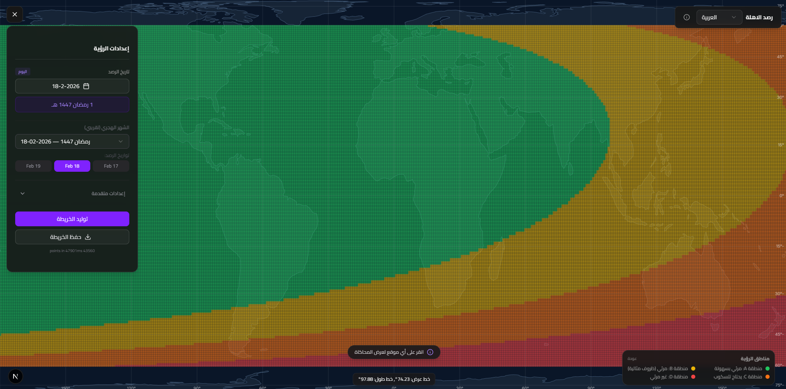
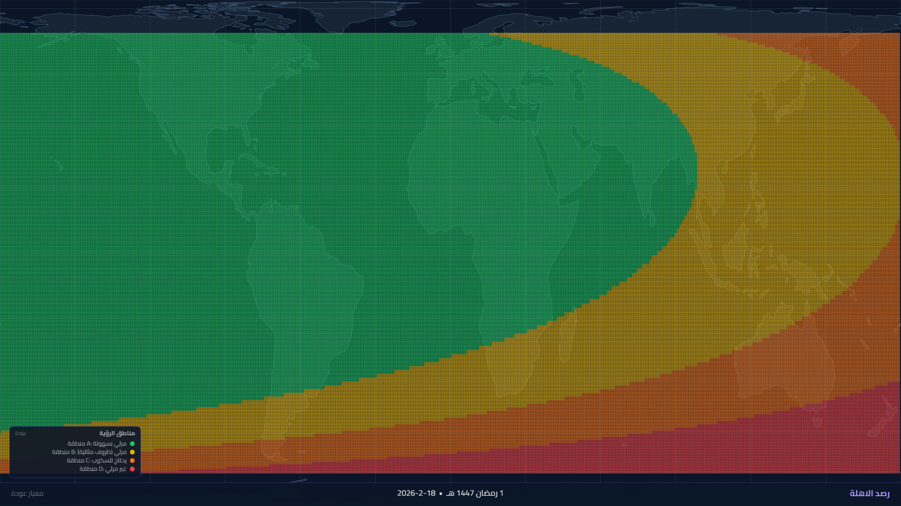
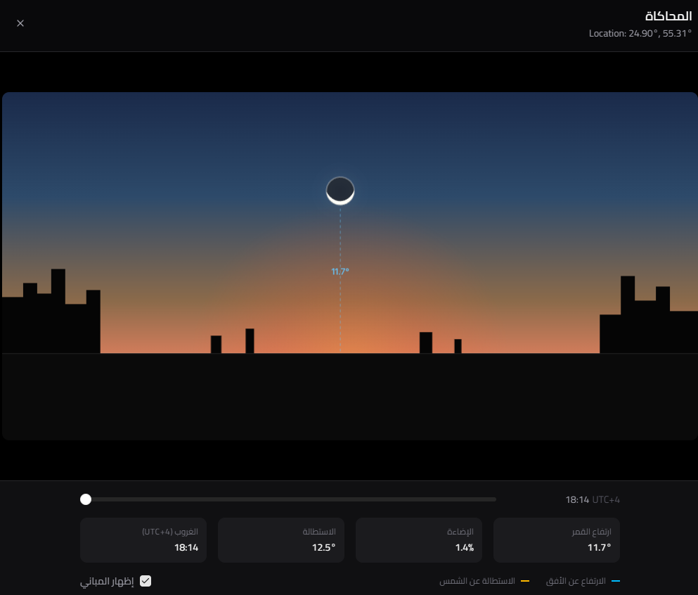

# Crescent Watch 🌙

**High-Precision Islamic Lunar Crescent Visibility Map & Simulation**

Crescent Watch is an advanced astronomical tool designed to predict and visualize the visibility of the new moon (Hilal) for Islamic calendar purposes. It utilizes high-precision calculcations (comparable to HMNAO/JPL) via **Skyfield** and implements standard criteria like **Yallop** and **Odeh** to generate global visibility maps.



## ✨ Key Features

*   **Global Visibility Maps**: Generates high-resolution heatmaps showing where the moon is visible (Zone A-D).
*   **Scientific Accuracy**: Uses `Skyfield` and `DE421` epnermeris for precise topocentric calculations.
*   **Multiple Criteria**: Support for **Yallop** (standard) and **Odeh** criteria.
*   **Live Simulation**: 3D-like simulation of the moon's position, rotation, and illumination.
*   **Localization**: Full **English** and **Arabic (RTL)** support with automatic layout mirroring.
*   **Downloadable Maps**: Export high-quality maps with full legends and Hijri dates.

---

## 📸 visual Overview

### 1. Global Visibility Map
The core feature—a color-coded map indicating visibility zones.


### 2. Moon Simulation
Visualizes the moon's exact orientation, age, and illumination at sunset.
<div style="display: flex; gap: 10px;">
  
  
</div>

---

## 🚀 Installation & Setup

This is a **Full Stack** application comprising a Python (FastAPI) backend and a Next.js (React) frontend.

### Prerequisites
*   **Python 3.9+**
*   **Node.js 18+**

### 1️⃣ Backend Setup (Python)

The backend performs the astronomical calculations.

1.  **Navigate to the root directory**:
    ```bash
    cd crescent-watch
    ```

2.  **Install Dependencies**:
    ```bash
    pip install -r requirements.txt
    ```

3.  **Run the Server**:
    ```bash
    uvicorn app:app --reload --port 8000
    ```
    *The API will start at `http://localhost:8000`*

### 2️⃣ Frontend Setup (Next.js)

The frontend provides the interactive map and UI.

1.  **Navigate to the frontend directory**:
    ```bash
    cd frontend
    ```

2.  **Install Dependencies**:
    ```bash
    npm install
    ```

3.  **Run the Development Server**:
    ```bash
    npm run dev
    ```

4.  **Open the App**:
    Visit `http://localhost:3000` in your browser.

---

## 🛠️ Usage Guide

1.  **Select Date**: Choose the Gregorian date for the observation.
2.  **Set Location**: Click anywhere on the map to see specific calculating for that point (Altitude, Elongation, DAZ).
3.  **Generate Map**: Click "Generate Map" to overlay the visibility zones.
    *   *Note: High resolution (0.25) takes longer but is more accurate.*
4.  **Simulation**: Click "View Simulation" to see the moon's appearance.
5.  **Save**: Click "Save Map" to download the official image with legend and branding.

---

## 📚 Technical Details

*   **Backend**: FastAPI, Skyfield, NumPy
*   **Frontend**: Next.js 13, TailwindCSS, Shadcn/UI, Canvas API
*   **Calculations**: Topocentric moon coordinates, semi-diameter correction, atmospheric refraction (optional).

---

**Developed by Constant Labs**
